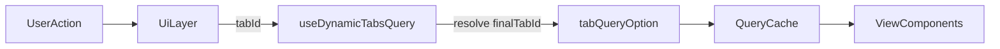

---
# try also 'default' to start simple
theme: seriph
# random image from a curated Unsplash collection by Anthony
# like them? see https://unsplash.com/collections/94734566/slidev
background: https://cover.sli.dev
# some information about your slides (markdown enabled)
title: Thunk to TanStack Query
info: |
  ## 以 202603 popFunny 專案為例，說明從 thunk 轉為 TanStack Query 的動機與改善點。
# apply UnoCSS classes to the current slide
class: text-center
# https://sli.dev/features/drawing
drawings:
  persist: false
# slide transition: https://sli.dev/guide/animations.html#slide-transitions
transition: slide-left
# enable Comark Syntax: https://comark.dev/syntax/markdown
comark: true
# duration of the presentation
duration: 35min
---

<!-- markdownlint-disable MD003 MD012 MD022 MD025 -->

## 從 Thunk 轉成 TanStack Query

以 `events/202603/popFunny` 為例

---
layout: two-cols
---

# 原本的開發痛點

- 一個分頁通常就要配一個 `slice`
- 除了 `service.js` 寫 thunk，還要再補 `slice.js` 存狀態
- CRUD 結果常常和 tab UI state 放在同一個 slice
- 狀態職責容易越長越混亂

::right::
# 直接感受到的成本

- 新增一個資料流程，常常不是只加 API
- 還要決定 state 掛哪個 slice
- 還要決定 reducer 要 export 哪些更新 function
- 或者重新 import 某個 tab 的 thunk 再呼叫一次
- UI 層會慢慢知道太多資料載入細節

---
layout: two-cols
---

# 舊做法：tab 切換會直接綁 thunk

```js
export const handlePanelInfo =
  (param = {}) =>
  async (dispatch) => {
    const { tabId } = param || {};

    switch (tabId) {
      case TAB_ID.TAB1:
        await dispatch(handleTab1SubTab2Info());
        break;
      case TAB_ID.TAB2:
        await dispatch(handleTab2Info());
        break;
      case TAB_ID.TAB3:
        await dispatch(handleTab3Info());
        break;
      default:
        dispatch(setTabId({ tabId }));
    }
  };
```

::right::

- UI 切 tab，背後其實要知道「該 dispatch 哪支 thunk」
- 預設頁如果不是 tab 本身，通常還要多包一層 re-export
- 分頁 routing、資料抓取、UI state 綁得很緊

---

# 為什麼改成 TanStack Query

## 關鍵想法

- 組裝資料時，不一定要先進 Redux store
- 如果只是為了取 state 才把 API 包成 thunk，成本其實很高
- Query hook 可以在組 option 時直接拿需要的 context
- 真正需要共用的是「資料快取」，不是每次都新增一個 slice

## 改完之後

- API 不需要為了 `getState()` 而被迫包成 thunk
- UI 不需要知道每個 tab 對應哪支 thunk
- CRUD 後的資料更新可以走 query cache

---
layout: two-cols

---

# 新做法：由 useDynamicTabsQuery 集中決定要抓什麼

```js
const getFinalTabId = (tabId) => {
  const TAB_ROUTE_MAP = {
    1: { subRoute: "1/2" },
    2: { subRoute: "" },
    3: { subRoute: "" },
    "1/1": { subRoute: "" },
    "1/2": { subRoute: "" },
  };
  const current = TAB_ROUTE_MAP[tabId];
  if (!current || !current.subRoute) {
    return tabId;
  }

  return getFinalTabId(current.subRoute);
};

const loadTabQueryOption = (tabId) =>
  import(`@/events/202603/popFunny/hooks/queries/panels/${tabId}`);
```

::right::

- `TAB_ROUTE_MAP` 決定某個 tab 的預設落點
- `getFinalTabId()` 統一解析最後要載入的分頁
- `loadTabQueryOption()` 動態載入對應 tab 的 query option

---
layout: center
---

# UI 層變簡單了

```js
const handleTabChange = (id) => {
  if (+id === +tabId) return;
  fetchTab(id);
};
```

來源：`events/202603/popFunny/Page.jsx`

```js
const handleNavChange = async (id) => {
  const tabId = id === 1 ? "1/1" : "1/2";
  await fetchTab(tabId);
};
```

來源：`events/202603/popFunny/Panel/Tab1/index.jsx`

- `onChange` 不用再把所有子 tab thunk 都 import 進來
- UI 只做一件事：告訴系統「我要哪個 tabId」
- 最後該抓哪個 query option，交給 `useDynamicTabsQuery`

---

# CRUD 完成後，更新資料也更直覺

```js
queryClient.setQueryData(PANEL_QUERY_KEY, (previousData) => ({
  ...previousData,
  userDrawCount,
}));
```

- 舊做法常見兩條路
- export reducer function，手動改 slice state
- 或 import 原本 tab 的 thunk，重新 dispatch 一次重抓資料

## 改成 Query 後

- 可以直接 `queryClient.setQueryData(...)`
- 或者用 `invalidateQueries` 讓資料重新抓取
- 更新資料的責任回到 cache，而不是散落在 reducer / thunk 之間

---
layout: two-cols
--- 

# Hooks Structure

```bash
hooks
├─ queries
│  ├─ donate
│  │  └─ index.js
│  ├─ draw
│  │  └─ index.js
│  ├─ drawLog
│  │  └─ index.js
│  ├─ panels
│  │  ├─ [id].js
│  │  └─ defaultTab
│  │     └─ index.js
│  └─ useDynamicTabsQuery.js
├─ useCachedQueryData.js
└─ useShowPageLoading.js
```

::right::

- queries 存放所有 api
- panels 存放各 tab 的 queryOption
- useDynamicTabsQuery 作為統一對外呼叫的窗口，接收 tabId 並動態呼叫對應的 api
- useCachedQueryData 取快取資料，對比現在用的 usePanel
- useShowPageLoading 偵測目前正在呼叫的 query or mutation，來決定是否顯示 loading

---

# queryOption 架構

## 主要對外 export 的 query option

###### (需要 querykey, queryFn, onSuccess, onError 4個參數)

```js
export const getQueryOption = (context) => ({
  queryKey: QUERY_KEY,
  queryFn: getQueryFunction(context),
  onSuccess,
  onError,
})
```

---

# queryOption 架構

## 主要呼叫 api 的 function
###### (資料轉換在這層處理 ex: composeTask)

```js
const getQueryFunction = (context) => async () => {
  const { configData, anchorPfid } = context
  const { id: actId } = configData
  const response = await fetchTab2Info({ actId, anchorPfid })
  const { countDown, groupId, anchorTasks, guestTasks, guestDrawCount } = response.data
  const { anchorTaskConfig, userTaskConfig } = configData.tab2Config

  return {
    groupId,
    countDown,
    userDrawCount: guestDrawCount,
    anchorTasks: composeTask(anchorTaskConfig, anchorTasks),
    userTasks: composeTask(userTaskConfig, guestTasks),
  }
}
```

---
layout: two-cols
---
## 成功處理

```js
const onSuccess = (data, { dispatch, queryClient }) => {
  const { logs, drawType, userDrawCount } = data

  const updateDrawCount = () => {
    queryClient.setQueryData(PANEL_QUERY_KEY, (previousData) => ({
      ...previousData,
      userDrawCount,
    }))
  }

  updateDrawCount()

  if (drawType === DRAW_TYPE.ONE) {
    // 單抽等轉盤動效結束後再顯示結果
    return
  }

  dispatch(openDrawResultModal({ logs }))
}
```

::right::

## 失敗處理

```js
const onError = (error, { dispatch }) => {
  if (error.toast) {
    dispatch(openToast(error.toast))
    return
  }

  dispatch(openToast({ title: error?.retMsg || '連線異常', type: 'danger' }))
}
```

---

# 架構上的實際改善



- 載入邏輯集中在一個入口，不再散在各 tab 的 thunk import
- tab default route 用 `TAB_ROUTE_MAP` 明確定義，不用再靠多包一層 index re-export
- 查詢資料以 cache 為核心，UI 改成讀結果，不必每頁維護一份 slice data
- tab 資料、CRUD 結果、重抓策略的責任邊界更清楚

---

# 這次遷移最有感的收穫

## 少了什麼

- 「為了抓資料而存在」的 thunk
- 「為了存 API 結果而存在」的 slice
- 每次使用 thunk 時需要呼叫 useDispatch
- 少很多 UI 對資料載入實作細節的認知

## 改善了什麼

- 降低 tab 與資料流的耦合
- 降低 CRUD 更新資料時的心智負擔
- 預設頁 routing 規則更直觀（定義在 TAB_ROUTE_MAP）
- 未來新增 tab / subtab 時，擴充點更集中

---

# 不完全移除 Redux，先把職責切分

目前 `popFunny` 仍然保留一些 Redux / thunk 職責：

- `config` 仍持有 `tabId`、`tab1SubTabId`、活動設定
- `modal confirm` 仍是 thunk 型式
- 某些 query `onSuccess` 還是會 dispatch UI state

## server & client state 分離

- 把「資料查詢與更新」從 slice/thunk 為主
- 移到「query cache 為主」的思考方式

---
layout: center
---

# 結論

---
layout: center
class: text-center
---

# 檔案數差異

{class="mx-auto max-h-100"}

